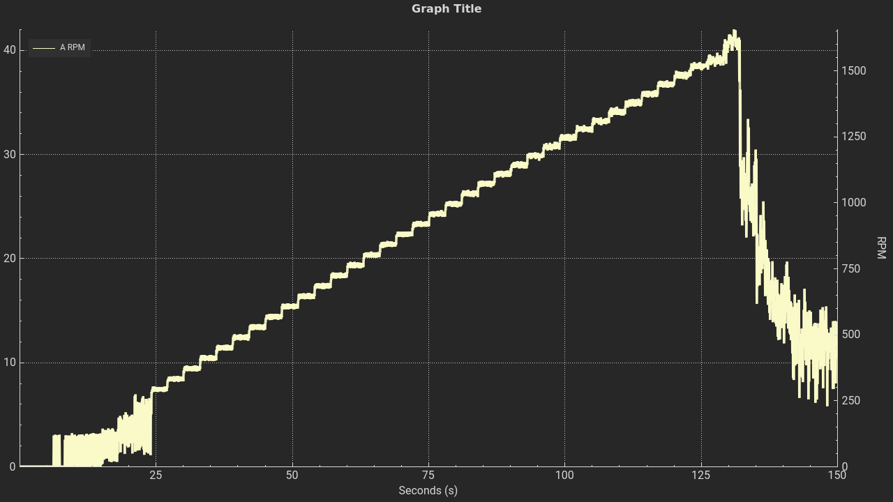

# RS485 Interface Commands and Documentation

## Context
### Board
This interface is intended, and only compatible with, the custom 410_LACEP revision of the VESC Controller.

### Parameters
The interface consists of an RS485 physical layer, using one differential pair. The data is transferred on a half-duplex serial UART running at **115200 baud**. 

### Command Structure
Each command consists of the *controller_id* a *command_name* and an optional sequence of *args* separated by *whitespace* and **wrapped with two *newline*** (\\n...\\n). 

```
\n<controller_id> <command_name> <args>\n
```
All commands return a *response* terminated by a single newline (\\n).
```
<response>\n
```
Some *command_names* are available in short form (the first letter).

In case a command does not match any on the list a error *response* will be returned `CMD_NOT_FOUND`.

Checkout the `test.py` file to see examples directly.

### Limitations
Preliminary tests have encountered problems running the board on the extremes of the possible range of control.
The following figure is the plot of a "VESC Motor Experiment" sweeping the duty cycle from 0% to 100%.



The x-axis is correlated with the duty cycle. The duty cycle is incremented by 2% every 3 seconds. So the start of the usable band is at around 24s, divide by 3, so 8 steps totalling 16%. The upper limit is also identified at 84%. **So the usable duty cycle range is from 16%-84%**.   

## Command List
### Duty Cycle Control
#### Set Duty Cycle with Ramp 

- Usage: `<id> duty <setpoint> <rate>`
- Short form: `d` 
- Ramps up/down the motor duty cycle at rate %/s with a timestep of 5 milliseconds.
- Response: Expected time to setpoint in seconds
- Example: `0 duty 0.3 0.6` returns `0.500`

### Encoder
#### Read Encoder Count

- Usage: `<id> encoder`
- Short form: `e`
- Gets current encoder position in degrees
- Response: `216.40`

#### Reset Encoder Count

- Usage: `<id> reset_encoder`
- Short form: `r`
- Rests current encoder count.
- Response: `0`

### Temperature
#### Read Temperature Sensors

- Usage: `<id> temp`
- Short form: `t`
- Returns current temperature of motor and MOSFET in degree Celsius, separated by a comma.

#### Read Motor Temperature Sensor

- Usage: `<id> temp_motor`
- Returns only the motor temperature in degree Celsius.

#### Read MOSFET Temperature Sensor

- Usage: `<id> temp_mosfet`
- Returns only the MOSFET temperature in degree Celsius.

### RPM Speed Control
#### Set RPM Speed 

- Usage: `<id> rpm <setpoint> <rate>`
- Alternative: `<id> speed <setpoint> <rate>`
- Ramps up/down the motor duty cycle at rate rad/s^2 with a timestep of 5 milliseconds.
- Response: Expected time to setpoint in seconds
- NOTE: The RPM Control loop is also subject to a limited usable range 
     and throughout testing it was less than the duty cycle control. So **this interface is not recommended**
